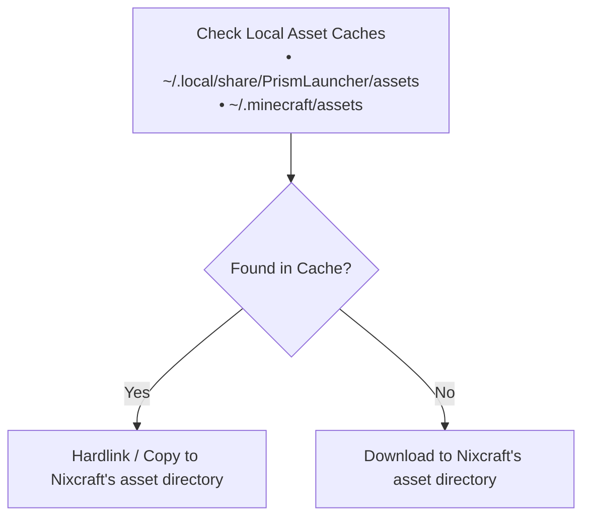

<div align="center">

# Nixcraft

*A declarative, reproducible Minecraft launcher and server manager in Nix*

[](https://nixos.org)
[](https://github.com/loystonpais/nixcraft)

[Features](#features) • [Quick Start](#quick-start) • [External Assets](#external-assets-recommended) • [Authentication](#authentication) • [Configuration Recipes](#configuration-recipes) • [Options Reference](#options-reference)

</div>

---

Nixcraft lets you build and run Minecraft clients and dedicated servers using Nix. Instead of managing instances through graphical launchers or manually copying files into mod folders, you define your instances in Nix code, including mod loaders, Modrinth packs, JVM flags, speedrunning tools (Waywall), and systemd services.

## Features

- **Client and server support**: Manage desktop client instances and dedicated servers from one consistent module system.
- **Mod loader support**: Built-in support for Fabric, Quilt, and Paper servers.
- **Modrinth modpacks (.mrpack)**: Point to an `.mrpack` file and Nixcraft downloads the mods, applies overrides, and figures out the right Minecraft and modloader versions automatically.
- **Zero-rebuild installs**: Run or install standalone instances using `nix run` or `nix profile add` without touching your system config or running `nixos-rebuild`.
- **Speedrunning (MCSR) support**: Built-in support for Waywall, practice map loading, standard settings injection, and GraalVM or ZGC tuning.
- **Efficiency and caching**: Reuses existing game assets from Prism Launcher and Vanilla Minecraft to avoid redundant downloads.
- **Systemd integration**: Run headless servers as user or system systemd services with auto-restart.

> [!IMPORTANT]
> Nixcraft is not yet officially allowed for Minecraft Speedrunning (MCSR) leaderboard submissions.

> [!WARNING]
> This project is a work in progress. While mostly functional, expect potential breaking changes on updates.

## Quick Start

Nixcraft can be used in several ways: it can be installed via **Home Manager**, as a **NixOS module** (for servers only), via **`nix profile`**, or simply run on the fly with **`nix run`**.

> [!IMPORTANT]
> When using `nix run` or `nix profile`, **`--impure` must be set**. This is only needed so Nix can read environment variables like `$HOME` and `$PWD` at evaluation time. Without it, Nix cannot determine your home or current directory, and all instance data will fall back to `/tmp/nixcraft-...`.

### 1. Home Manager (For Both Clients and Servers)

Add Nixcraft to your `flake.nix` inputs:

```nix
# flake.nix
{
  inputs = {
    nixpkgs.url = "github:NixOS/nixpkgs/nixos-unstable";
    home-manager.url = "github:nix-community/home-manager";
    nixcraft = {
      url = "github:loystonpais/nixcraft";
      inputs.nixpkgs.follows = "nixpkgs";
    };
  };

  outputs = { nixpkgs, home-manager, nixcraft, ... }: {
    # Home Manager configuration
  };
}
```

Import `inputs.nixcraft.homeModules.default` in your Home Manager configuration:

```nix
# home.nix
{ config, pkgs, inputs, ... }: {
  imports = [
    inputs.nixcraft.homeModules.default
  ];

  nixcraft = {
    enable = true;

    client = {
      shared = {
        enableExternalAssets = true;
        account = {
          username = "nixcrafter";
          offline = true;
        };
      };

      instances.survival = {
        version = "1.21.1";
        desktopEntry.enable = true;
      };
    };
  };
}
```

### 2. NixOS Module (Servers Only)

Import `inputs.nixcraft.nixosModules.default` in your `configuration.nix` to declare system-level servers running under systemd:

```nix
# configuration.nix
{ config, pkgs, inputs, ... }: {
  imports = [
    inputs.nixcraft.nixosModules.default
  ];

  nixcraft = {
    enable = true;

    server.instances.smp = {
      version = "1.21.1";
      agreeToEula = true;
      paper.enable = true;
      java.memory = 4096;

      service = {
        enable = true;
        autoStart = true;
      };
    };
  };
}
```

### 3. Standalone with `nix profile`

Install an instance directly into your user environment using simple combinators without modifying system files:

```bash
# Install a client instance (adds binary to $PATH and creates a desktop menu shortcut)
nix profile add --impure github:loystonpais/nixcraft#client.withExternalAssets.v1-21-1

# Install a Paper server
nix profile add --impure github:loystonpais/nixcraft#server.agreeToEula.paper.v1-21-1
```

When a server is added via `nix profile`, a systemd user service is automatically included. You can enable or disable it using standard `systemctl --user`:

```bash
# Start or enable the server user service
systemctl --user start nixcraft-server-default
systemctl --user enable nixcraft-server-default

# Stop or disable it
systemctl --user stop nixcraft-server-default
systemctl --user disable nixcraft-server-default
```

To uninstall an instance:

```bash
nix profile remove nixcraft-client-default # or nixcraft-server-default
```

### 4. Run on the fly with `nix run`

Run an instance immediately without installing anything permanently:

```bash
# Run client on 1.21.1 with external assets
nix run --impure github:loystonpais/nixcraft#client.withExternalAssets.v1-21-1

# Run a dedicated Paper server on 1.21.1
nix run --impure github:loystonpais/nixcraft#server.agreeToEula.paper.v1-21-1
```

#### Chaining Multiple Combinators

Multiple combinators can be chained together via dot-notation:

```bash
# Paper server + EULA + offline mode + version
nix run --impure github:loystonpais/nixcraft#server.agreeToEula.paper.offlineMode.v1-21-1
```

### Portable Game Directories (`.pwd`)

`pwd` is a combinator that sets the instance's game directory to your current working directory (`$PWD`). If a `nixcraft.nix` file exists in that directory, it is automatically picked up and applied as the instance configuration.

This means you can keep your `nixcraft.nix` configuration, world data, mods, and all game files together in a single self-contained folder and move it between machines.

Create a folder with a `nixcraft.nix` inside:

```nix
# ./nixcraft.nix
{
  name = "survival-smp";
  version = "1.21.1";
  agreeToEula = true;
  paper.enable = true;
  serverProperties = {
    motd = "My Portable Nixcraft Server";
    difficulty = "hard";
  };
}
```

Then `cd` into the directory and run:

```bash
# For a server
nix run --impure github:loystonpais/nixcraft#server.pwd

# For a client
nix run --impure github:loystonpais/nixcraft#client.pwd
```

All game files and world data stay inside that directory. Since `pwd` is just another combinator, it composes with others the same way:

```bash
nix run --impure github:loystonpais/nixcraft#server.pwd.withLazymc
```

### Advanced Customization with `--expr`

For more advanced customizations or quick one-off tweaks, use `--expr` to define arbitrary configurations:

```bash
nix run --impure --expr '
(builtins.getFlake "github:loystonpais/nixcraft").packages.x86_64-linux.server
  .agreeToEula
  .paper
  .named "creative-hub"
  .withConfig {
    version = "1.21.1";
    serverProperties = {
      "max-players" = 10;
      gamemode = "creative";
    };
  }
'
```

## External Assets (Recommended)

A typical Minecraft installation contains thousands of individual asset files like sounds, textures, and fonts. If Nix downloads and hashes each one into the `/nix/store`, evaluations and builds slow down significantly.

To prevent this, Nixcraft includes an external asset fetcher that runs outside the Nix store:

```nix
nixcraft.client.shared = {
  enableExternalAssets = true;
};
```

### How It Works



When `enableExternalAssets` is enabled:
1. Nix only downloads the small version asset index JSON file.
2. Before launching the game, Nixcraft downloads any missing assets directly to `~/.local/share/nixcraft/client/assets`.
3. If you already have assets downloaded from Prism Launcher or the official Minecraft launcher, it reuses those files directly instead of downloading them again.

> [!TIP]
> Set `enableExternalAssets = true` under `nixcraft.client.shared` to avoid duplicating the option for each instance.

## Authentication

Nixcraft supports both offline and Microsoft-authenticated accounts via the `account` option on client instances or globally under `nixcraft.client.shared.account`.

### Offline Accounts

For offline play or local testing, set `offline = true` and specify a username:

```nix
nixcraft.client.shared.account = {
  offline = true;
  username = "nixcrafter";
  # uuid = "..."; # Optional account UUID
};
```

### Online Accounts (Microsoft)

For connecting to online servers and Realms, set `offline = false`. Nixcraft uses a device code authentication flow: on first launch, it displays a code in the terminal that you enter at [microsoft.com/link](https://microsoft.com/link) to sign in, similar to how Prism Launcher handles authentication. Valid session tokens are then pulled dynamically at launch without storing passwords or credentials inside your Nix code:

```nix
nixcraft.client.shared.account = {
  offline = false;
  uuid = "..."; # Account UUID
  # username = "..."; # Optional username for verification
};
```

When `uuid` is not provided in online mode, it will automatically be picked up from the `NIXCRAFT_CLIENT_AUTH_UUID` environment variable.

In both Home Manager and NixOS, you can set this variable declaratively:

```nix
nixcraft.client.auth.uuid = "your-account-uuid";
```

Or export it directly in your shell:

```bash
export NIXCRAFT_CLIENT_AUTH_UUID="your-account-uuid"
```

## Configuration Recipes

### 1. Modrinth Modpack (`.mrpack`)

When values can be known from other places, they will be inferred. For example, Nixcraft can extract `.mrpack` files directly: it downloads all the listed mods, copies overrides, and infers the right Minecraft and mod loader versions automatically:

```nix
{ pkgs, ... }: {
  nixcraft.client.instances.optimized = {
    enableExternalAssets = true;

    mrpack = {
      enable = true;
      file = pkgs.fetchurl {
        url = "https://cdn.modrinth.com/data/BYfVnHa7/versions/vZZwrcPm/Simply%20Optimized-1.21.1-5.0.mrpack";
        hash = "sha256-n2BxHMmqpOEMsvDqRRYFfamcDCCT4ophUw7QAJQqXmg=";
      };
    };

    desktopEntry = {
      enable = true;
      name = "Simply Optimized";
    };
  };
}
```

### 2. Dedicated Paper or Fabric Server with Systemd

Run a dedicated Paper or Fabric server in the background using systemd:

```nix
nixcraft.server.instances.survival-smp = {
  version = "1.21.1";
  agreeToEula = true;

  paper.enable = true; # Or set fabricLoader.enable = true;

  java = {
    memory = 4096;
    extraArguments = [
      # Extra JVM flags can be added here
    ];
  };

  serverProperties = {
    motd = "Welcome to Nixcraft SMP";
    "max-players" = 20;
    "difficulty" = "hard";
    "online-mode" = true;
    "server-port" = 25565;
  };

  # Creates and manages nixcraft-server-survival-smp.service
  service = {
    enable = true;
    autoStart = true;
  };
};
```

### 3. Speedrunning (MCSR) with Waywall

For Minecraft Speedrunning on Linux, you can enable Waywall, automatically extract practice maps, inject your config files, and tune Java:

```nix
{ pkgs, ... }: {
  nixcraft.client.instances.rsg = {
    enableExternalAssets = true;

    version = "1.16.1";

    waywall.enable = true;

    mrpack = {
      enable = true;
      file = pkgs.fetchurl {
        url = "https://cdn.modrinth.com/data/1uJaMUOm/versions/jIrVgBRv/SpeedrunPack-mc1.16.1-v5.3.0.mrpack";
        hash = "sha256-uH/fGFrqP2UpyCupyGjzFB87LRldkPkcab3MzjucyPQ=";
      };
    };

    # Automatically fetch and extract practice maps
    saves."Practice Map" = pkgs.fetchzip {
      url = "https://github.com/Dibedy/The-MCSR-Practice-Map/releases/download/1.0.1/MCSR.Practice.v1.0.1.zip";
      stripRoot = false;
      hash = "sha256-ukedZCk6T+KyWqEtFNP1soAQSFSSzsbJKB3mU3kTbqA=";
    };

    # Place custom configs or extra mod jars directly in the instance (optional)
    # files = {
    #   "config/mcsr/standardsettings.json".source = ./standardsettings.json;
    #   "options.txt".source = ./options.txt;
    # };

    # JVM optimization
    java = {
      package = pkgs.jdk17;
      minMemory = 3500;
      maxMemory = 3500;
      extraArguments = [
        "-XX:+UseZGC"
        "-XX:+AlwaysPreTouch"
        "-Dgraal.TuneInlinerExploration=1"
        "-XX:NmethodSweepActivity=1"
      ];
    };

    binEntry = {
      enable = true;
      name = "rsg";
    };
  };
}
```

### 4. Shared Client Settings and GPU Offloading

Use `client.shared` so you do not have to repeat account info or GPU settings across multiple instances:

```nix
{ config, ... }: {
  nixcraft.client.shared = {
    enableExternalAssets = true;

    # GPU acceleration
    useDiscreteGPU = true;

    # Symlink screenshots from all instances into your Pictures folder
    files."screenshots".source =
      config.lib.file.mkOutOfStoreSymlink "${config.home.homeDirectory}/Pictures/Minecraft";

    # Common account profile
    account = {
      username = "nixcrafter";
      offline = true;
    };

    binEntry.enable = true;
  };
}
```

## Options Reference

Every configuration option exposed by Nixcraft is documented with descriptions, types, and defaults.

- See [docs/NIXCRAFT-OPTIONS.gen.md](docs/NIXCRAFT-OPTIONS.gen.md) for the full generated options reference.
