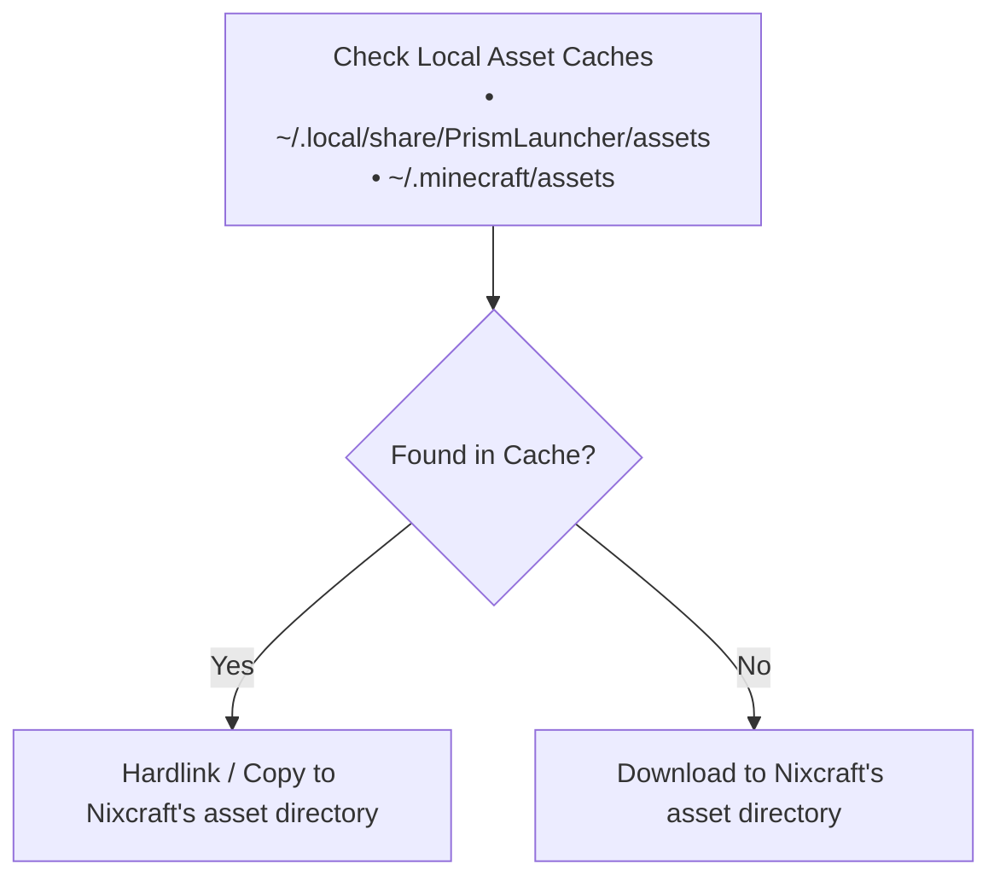

<div align="center">

# Nixcraft

*A declarative, reproducible Minecraft launcher and server manager in Nix*

[](https://nixos.org)
[](https://github.com/loystonpais/nixcraft)

[Features](#features) • [Quick Start](#quick-start) • [Installation](#installation) • [External Assets](#external-assets-recommended) • [Authentication](#authentication) • [Configuration Recipes](#configuration-recipes) • [Options Reference](#options-reference)

</div>

---

Nixcraft lets you build and run Minecraft clients and dedicated servers using Nix. Instead of managing instances through graphical launchers or manually copying files into mod folders, you define your instances in Nix code, including mod loaders, Modrinth packs, JVM flags, speedrunning tools (Waywall), and systemd services.

## Features

- **Client and server support**: Manage desktop client instances and dedicated servers from one consistent module system.
- **Mod loader support**: Built-in support for Fabric, Quilt, and Paper servers.
- **Modrinth modpacks (.mrpack)**: Point to an `.mrpack` file and Nixcraft downloads the mods, applies overrides, and figures out the right Minecraft and modloader versions automatically.
- **Zero-rebuild installs**: Run or install standalone instances using `nix run` or `nix profile add` without touching your system config or running `nixos-rebuild`.
- **Speedrunning (MCSR) support**: Built-in support for Waywall, practice map loading, standard settings injection, and GraalVM or ZGC tuning.
- **Efficiency and caching**: Reuses existing game assets from Prism Launcher and Vanilla Minecraft to avoid redundant downloads.
- **Systemd integration**: Run headless servers as user or system systemd services with auto-restart.

> [!IMPORTANT]
> Nixcraft is not yet officially allowed for Minecraft Speedrunning (MCSR) leaderboard submissions.

> [!WARNING]
> This project is a work in progress. While mostly functional, expect potential breaking changes on updates.

## Quick Start

You can run an instance right away without installing anything permanently:

### Run a Client Instance

Using presets (combinators):

```bash
nix run --impure "github:loystonpais/nixcraft#client.withExternalAssets.v1-21-1"
```

Custom setup:

```bash
nix run --impure --expr '
(builtins.getFlake "github:loystonpais/nixcraft").outputs.packages.x86_64-linux.client.override {
  cfg = {
    version = "1.21.1";
    account = { offline = true; };
    enableExternalAssets = true; # Recommended for faster installation
    absoluteDir = "${builtins.getEnv "PWD"}/game-dir";
  };
}
'
```

### Run a Dedicated Server

```bash
nix run --impure --expr '
(builtins.getFlake "github:loystonpais/nixcraft").outputs.packages.x86_64-linux.server.override {
  cfg = {
    version = "1.21.1";
    agreeToEula = true;
    absoluteDir = "${builtins.getEnv "PWD"}/game-dir";
  };
}
'
```

> [!IMPORTANT]
> Dedicated servers require accepting the Mojang EULA by setting `agreeToEula = true;`.

## Installation

There are three ways to use Nixcraft depending on your setup.

### 1. Standalone with `nix profile` (Fastest for Single Instances)

If you want to install a client or server without changing your NixOS or Home Manager configuration, use `nix profile add`. This puts the launcher binary in your `$PATH` and creates a desktop shortcut:

```bash
nix profile add --impure --expr '
(builtins.getFlake "github:loystonpais/nixcraft").outputs.packages.x86_64-linux.client.override {
  name = "mc-vanilla";
  cfg = {
    version = "1.21.1";
    account = { offline = true; };
    enableExternalAssets = true;
    desktopEntry.name = "Minecraft 1.21.1";
    absoluteDir = "${builtins.getEnv "HOME"}/.local/share/mc-vanilla";
  };
}
'
```

Once added, start it with `nixcraft-client-mc-vanilla` in your terminal or launch **Minecraft 1.21.1** from your desktop app menu.

To uninstall it:

```bash
nix profile remove mc-vanilla
```

### 2. Home Manager (For Both Clients and Servers)

Add Nixcraft to your `flake.nix` inputs:

```nix
# flake.nix
{
  inputs = {
    nixpkgs.url = "github:NixOS/nixpkgs/nixos-unstable";
    home-manager.url = "github:nix-community/home-manager";
    nixcraft = {
      url = "github:loystonpais/nixcraft";
      inputs.nixpkgs.follows = "nixpkgs";
    };
  };

  outputs = { nixpkgs, home-manager, nixcraft, ... }: {
    # Home Manager configuration
  };
}
```

Import `inputs.nixcraft.homeModules.default` in your Home Manager configuration:

```nix
# home.nix
{ config, pkgs, inputs, ... }: {
  imports = [
    inputs.nixcraft.homeModules.default
  ];

  nixcraft = {
    enable = true;

    client = {
      shared = {
        enableExternalAssets = true;
        account = {
          username = "nixcrafter";
          offline = true;
        };
      };

      instances.survival = {
        enable = true;
        version = "1.21.1";
        desktopEntry.enable = true;
      };
    };
  };
}
```

### 3. NixOS Module (Servers Only)

Import `inputs.nixcraft.nixosModules.default` in your `configuration.nix` to declare system-level servers running under systemd:

```nix
# configuration.nix
{ config, pkgs, inputs, ... }: {
  imports = [
    inputs.nixcraft.nixosModules.default
  ];

  nixcraft = {
    enable = true;

    server.instances.smp = {
      enable = true;
      version = "1.21.1";
      agreeToEula = true;
      paper.enable = true;
      java.memory = 4096;

      service = {
        enable = true;
        autoStart = true;
      };
    };
  };
}
```

## External Assets (Recommended)

A typical Minecraft installation contains thousands of individual asset files like sounds, textures, and fonts. If Nix downloads and hashes each one into the `/nix/store`, evaluations and builds slow down significantly.

To prevent this, Nixcraft includes an external asset fetcher that runs outside the Nix store:

```nix
nixcraft.client.shared = {
  enableExternalAssets = true;
};
```

### How It Works



When `enableExternalAssets` is enabled:
1. Nix only downloads the small version asset index JSON file.
2. Before launching the game, Nixcraft downloads any missing assets directly to `~/.local/share/nixcraft/client/assets`.
3. If you already have assets downloaded from Prism Launcher or the official Minecraft launcher, it reuses those files directly instead of downloading them again.

> [!TIP]
> Set `enableExternalAssets = true` under `nixcraft.client.shared` to avoid duplicating the option for each instance.

## Authentication

Nixcraft supports both offline and Microsoft-authenticated accounts via the `account` option on client instances or globally under `nixcraft.client.shared.account`.

### Offline Accounts

For offline play or local testing, set `offline = true` and specify a username:

```nix
nixcraft.client.shared.account = {
  offline = true;
  username = "nixcrafter";
  # uuid = "..."; # Optional account UUID
};
```

### Online Accounts (Microsoft)

For connecting to online servers and Realms, set `offline = false`. Nixcraft pulls valid session tokens dynamically at launch without storing your passwords or credentials inside your Nix code:

```nix
nixcraft.client.shared.account = {
  offline = false;
  uuid = "..."; # Account UUID
  # username = "..."; # Optional username for verification
};
```

## Configuration Recipes

### 1. Modrinth Modpack (`.mrpack`) with Auto-Inference

Nixcraft can extract `.mrpack` files directly. It downloads all the listed mods, copies overrides, and automatically sets the right Minecraft and Fabric or Quilt versions:

```nix
{ pkgs, ... }: {
  nixcraft.client.instances.optimized = {
    enable = true;
    enableExternalAssets = true;

    mrpack = {
      enable = true;
      file = pkgs.fetchurl {
        url = "https://cdn.modrinth.com/data/BYfVnHa7/versions/vZZwrcPm/Simply%20Optimized-1.21.1-5.0.mrpack";
        hash = "sha256-n2BxHMmqpOEMsvDqRRYFfamcDCCT4ophUw7QAJQqXmg=";
      };
    };

    desktopEntry = {
      enable = true;
      name = "Simply Optimized";
    };
  };
}
```

### 2. Dedicated Paper or Fabric Server with Systemd

Run a dedicated Paper or Fabric server in the background using systemd:

```nix
nixcraft.server.instances.survival-smp = {
  enable = true;
  version = "1.21.1";
  agreeToEula = true;

  paper.enable = true; # Or set fabricLoader.enable = true;

  java = {
    memory = 4096;
    extraArguments = [
      # Extra JVM flags can be added here
    ];
  };

  serverProperties = {
    motd = "Welcome to Nixcraft SMP";
    "max-players" = 20;
    "difficulty" = "hard";
    "online-mode" = true;
    "server-port" = 25565;
  };

  # Creates and manages nixcraft-server-survival-smp.service
  service = {
    enable = true;
    autoStart = true;
  };
};
```

### 3. Speedrunning (MCSR) with Waywall

For Minecraft Speedrunning on Linux, you can enable Waywall, automatically extract practice maps, inject your config files, and tune Java:

```nix
{ pkgs, ... }: {
  nixcraft.client.instances.rsg = {
    enable = true;
    enableExternalAssets = true;

    version = "1.16.1";

    waywall.enable = true;

    mrpack = {
      enable = true;
      file = pkgs.fetchurl {
        url = "https://cdn.modrinth.com/data/1uJaMUOm/versions/jIrVgBRv/SpeedrunPack-mc1.16.1-v5.3.0.mrpack";
        hash = "sha256-uH/fGFrqP2UpyCupyGjzFB87LRldkPkcab3MzjucyPQ=";
      };
    };

    # Automatically fetch and extract practice maps
    saves."Practice Map" = pkgs.fetchzip {
      url = "https://github.com/Dibedy/The-MCSR-Practice-Map/releases/download/1.0.1/MCSR.Practice.v1.0.1.zip";
      stripRoot = false;
      hash = "sha256-ukedZCk6T+KyWqEtFNP1soAQSFSSzsbJKB3mU3kTbqA=";
    };

    # Place custom configs or extra mod jars directly in the instance (optional)
    # files = {
    #   "config/mcsr/standardsettings.json".source = ./standardsettings.json;
    #   "options.txt".source = ./options.txt;
    # };

    # JVM optimization
    java = {
      package = pkgs.jdk17;
      minMemory = 3500;
      maxMemory = 3500;
      extraArguments = [
        "-XX:+UseZGC"
        "-XX:+AlwaysPreTouch"
        "-Dgraal.TuneInlinerExploration=1"
        "-XX:NmethodSweepActivity=1"
      ];
    };

    binEntry = {
      enable = true;
      name = "rsg";
    };
  };
}
```

### 4. Shared Client Settings and GPU Offloading

Use `client.shared` so you do not have to repeat account info or GPU settings across multiple instances:

```nix
{ config, ... }: {
  nixcraft.client.shared = {
    enableExternalAssets = true;

    # GPU acceleration
    useDiscreteGPU = true;

    # Symlink screenshots from all instances into your Pictures folder
    files."screenshots".source =
      config.lib.file.mkOutOfStoreSymlink "${config.home.homeDirectory}/Pictures/Minecraft";

    # Common account profile
    account = {
      username = "nixcrafter";
      offline = true;
    };

    binEntry.enable = true;
  };
}
```

## Options Reference

Every configuration option exposed by Nixcraft is documented with descriptions, types, and defaults.

- See [docs/NIXCRAFT-OPTIONS.gen.md](docs/NIXCRAFT-OPTIONS.gen.md) for the full generated options reference.
